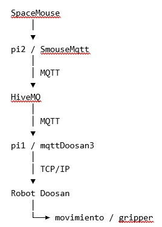
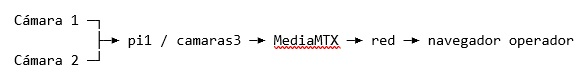
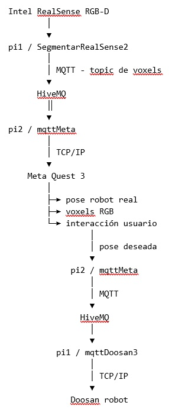
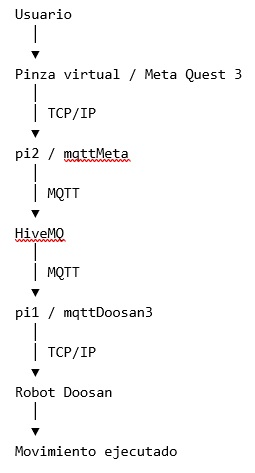
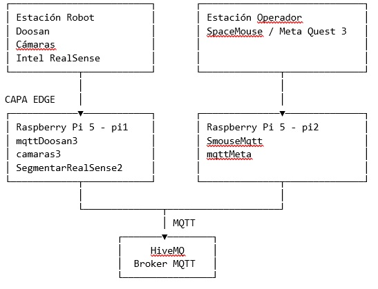

**COBOT PARA INCLUSION:**

**Arquitectura**

**  
Versión: 7 agosto 2026**

**Descripción: Arquitectura general del sistema**

# 1\. Propósito y alcance

Este documento describe la arquitectura global del sistema de teleoperación del robot Doosan. La arquitectura se divide en dos estaciones: la estación del robot y la estación del operador. Ambas estaciones utilizan Raspberry Pi 5 y se comunican mediante un servidor MQTT en HiveMQ.

El sistema dispone de dos modos de operación. En el Modo 1 el operador utiliza un SpaceMouse 3Dconnexion y recibe video de dos cámaras de la estación del robot. En el Modo 2 el operador utiliza Meta Quest 3; la estación del robot segmenta mediante una cámara Intel RealSense y transmite voxels con información RGB para su visualización en realidad aumentada.

La documentación se basa en la descripción proporcionada en esta conversación y en las documentaciones previamente realizadas para los scripts y el proyecto Unity. Los nombres de scripts, dispositivos y roles se conservan según dicha descripción.

# 2\. Vista general de la arquitectura
arquitectura1

# 3\. Componentes principales

| Componente             | Ubicación         | Software / interfaz        | Función                                                              |
| ---------------------- | ----------------- | -------------------------- | -------------------------------------------------------------------- |
| Robot Doosan           | Estación robot    | Programa DRL documentado   | Ejecuta movimientos y controla gripper.                              |
| pi1                    | Estación robot    | Raspberry Pi 5             | Puente robot-MQTT; cámaras; segmentación RealSense.                  |
| pi2                    | Estación operador | Raspberry Pi 5             | Entrada SpaceMouse o puente Meta Quest-MQTT.                         |
| HiveMQ                 | Servidor central  | MQTT                       | Intercambio de mensajes entre pi1 y pi2.                             |
| SpaceMouse 3Dconnexion | Estación operador | USB / SmouseMqtt           | Genera comandos de teleoperación en Modo 1.                          |
| Dos cámaras            | Estación robot    | camaras3 + MediaMTX        | Streaming de video en Modo 1.                                        |
| Intel RealSense RGB-D  | Estación robot    | SegmentarRealSense2        | Segmentación por profundidad/color y generación de voxels en Modo 2. |
| Meta Quest 3           | Estación operador | Unity / Meta XR + mqttMeta | Visualización AR e interacción espacial en Modo 2.                   |

# 4\. Estación del robot - pi1

pi1 es la Raspberry Pi 5 situada físicamente en la estación del robot. Es el punto de integración de los dispositivos de percepción y del robot Doosan.

- mqttDoosan3 mantiene la comunicación con HiveMQ mediante MQTT.
- mqttDoosan3 mantiene la comunicación TCP/IP con el robot Doosan.
- Modo 1: camaras3 configura las dos cámaras y habilita su streaming mediante MediaMTX.
- Modo 2: SegmentarRealSense2 captura la cámara Intel RealSense, segmenta las piezas y publica los voxels.

# 5\. Estación del operador - pi2

pi2 es la Raspberry Pi 5 ubicada en la estación del operador. Su función depende del modo seleccionado.

- Modo 1: ejecuta SmouseMqtt, recibe las señales del SpaceMouse y publica los comandos mediante MQTT.
- Modo 1: el operador visualiza en el navegador el streaming producido por pi1.
- Modo 2: ejecuta mqttMeta, recibe desde MQTT la pose del robot y los voxels, y los transmite a Meta Quest 3 mediante TCP/IP.

# 6\. Servidor HiveMQ

HiveMQ actúa como intermediario MQTT entre pi1 y pi2. Las Raspberry Pi no necesitan una conexión TCP directa entre sí para intercambiar la información funcional de teleoperación: los mensajes se publican y consumen mediante topics MQTT.

En Modo 2 se utiliza un topic específico para la información de voxels, distinto del utilizado para los demás mensajes de teleoperación, según la descripción proporcionada.

# 7\. Robot Doosan

El robot ejecuta el programa **_raspberry.drl_**. El mismo programa se utiliza en ambos modos de operación.

- Un hilo principal de escucha recibe desde Raspberry Pi la pose o instrucción de movimiento.
- El robot ejecuta el movimiento solicitado.
- El programa recibe también la orden de abrir o cerrar el gripper conectado al DO\[8\].
- Otro hilo transmite periódicamente la pose actual del robot hacia Raspberry Pi.

La comunicación entre pi1 y el robot se realiza por TCP/IP con IPs fijas, de acuerdo con la arquitectura indicada.

# 8\. Modo 1 - Teleoperación mediante SpaceMouse

En el Modo 1, el operador genera directamente los movimientos deseados mediante un SpaceMouse 3Dconnexion. El video de las cámaras de la estación robot proporciona al operador la percepción visual de la escena.

 Cámaras ─► pi1 / camaras3 ─► MediaMTX ─► navegador del operador

# 9\. Flujo funcional del Modo 1

1. El operador mueve el SpaceMouse.
2. SmouseMqtt recibe las señales del dispositivo en pi2.
3. SmouseMqtt acota/procesa las señales y las publica en MQTT.
4. HiveMQ distribuye el mensaje al consumidor correspondiente en pi1.
5. mqttDoosan3 recibe la instrucción y la convierte en la comunicación esperada por el robot.
6. mqttDoosan3 transmite la orden al Doosan mediante TCP/IP.
7. El programa DRL del robot ejecuta el movimiento y/o acciona el gripper.
8. El robot envía periódicamente su pose a pi1.
9. pi1 puede publicar la información correspondiente mediante MQTT para el sistema.
10. Paralelamente, camaras3 mantiene el streaming de las dos cámaras hacia el operador.

# 10\. Streaming de video en Modo 1

Las dos cámaras de la estación robot están conectadas físicamente a pi1. El script camaras3 configura las cámaras y abre el servicio de streaming mediante MediaMTX.

El streaming es independiente del canal MQTT de teleoperación. MQTT transporta los mensajes de control/datos, mientras que MediaMTX proporciona el canal de video.

# 11\. Modo 2 - Teleoperación mediante percepción y Meta Quest 3

El Modo 2 sustituye la visualización directa por video por una representación espacial en Meta Quest 3. pi1 utiliza la cámara Intel RealSense RGB-D para identificar los píxeles/voxels asociados a las piezas a manipular.

# 12\. Segmentación en Modo 2

SegmentarRealSense2 se ejecuta en pi1 y utiliza la cámara Intel RealSense. El procesamiento segmenta las piezas mediante información de profundidad, color HSV y bounding box.

El resultado es una lista de píxeles/voxels segmentados que contiene coordenadas espaciales y canales RGB. La documentación previa del script describe la información como una lista de sublistas con valores X, Y, Z, R, G y B.

\[\[X,Y,Z,R,G,B\], \[X,Y,Z,R,G,B\], ...\]

La lista se publica hacia HiveMQ en un topic específico de voxels. La aplicación Quest recibe estos datos a través de mqttMeta y los transmite al proyecto Unity mediante TCP/IP.

# 13\. Meta Quest 3 en Modo 2

La aplicación Unity de Meta Quest 3 recibe desde mqttMeta la pose del robot y la lista de voxels. La aplicación representa los voxels en la escena AR y muestra una representación de la pinza/robot.

- La pose recibida se utiliza para posicionar la representación de la pinza real.
- Los voxels se convierten en objetos visuales utilizando sus coordenadas y RGB.
- La pinza virtual es manipulada por el usuario.
- Cuando el usuario solicita mover el robot, Quest calcula la posición objetivo.
- Quest transmite la pose/desplazamiento deseado a mqttMeta mediante TCP/IP.
- mqttMeta publica la instrucción en HiveMQ.

# 14\. Retorno de la pose deseada en Modo 2

# 15\. Datos principales del sistema

| Dato                | Origen                          | Ruta                         | Destino                          |
| ------------------- | ------------------------------- | ---------------------------- | -------------------------------- |
| Comando SpaceMouse  | SpaceMouse                      | pi2 → MQTT → pi1 → TCP       | Robot Doosan                     |
| Pose real del robot | Robot Doosan                    | TCP → pi1 → MQTT → pi2       | Operador / Meta Quest según modo |
| Video               | Dos cámaras                     | pi1 → MediaMTX → red         | Navegador del operador           |
| Voxels RGB          | Intel RealSense                 | pi1 → MQTT → pi2 → TCP       | Meta Quest 3                     |
| Pose deseada        | Meta Quest 3                    | TCP → pi2 → MQTT → pi1 → TCP | Robot Doosan                     |
| Gripper             | SpaceMouse/Quest según interfaz | operador → MQTT/TCP          | DO\[8\] del Doosan               |

# 16\. Separación de responsabilidades

| Elemento                  | Responsabilidad                                       | No es responsable de                          |
| ------------------------- | ----------------------------------------------------- | --------------------------------------------- |
| Doosan                    | Movimiento físico y gripper; generación de pose real. | MQTT, segmentación, streaming.                |
| pi1 / mqttDoosan3         | Puente MQTT ↔ TCP con Doosan.                         | Interfaz de usuario.                          |
| pi1 / camaras3            | Configuración y streaming de cámaras.                 | Control del robot.                            |
| pi1 / SegmentarRealSense2 | Percepción y segmentación de piezas.                  | Movimiento directo del robot.                 |
| HiveMQ                    | Broker MQTT y distribución de mensajes.               | Procesamiento físico del robot o renderizado. |
| pi2 / SmouseMqtt          | Entrada SpaceMouse y publicación de comandos.         | Procesamiento del robot.                      |
| pi2 / mqttMeta            | Puente MQTT ↔ TCP con Meta Quest.                     | Renderizado XR.                               |
| Meta Quest 3              | Visualización AR e interacción del operador.          | Conexión directa con Doosan.                  |

# 17\. Diagrama de arquitectura por capas

CAPA FÍSICA  

 MODO 1: SpaceMouse + Video  
MODO 2: RealSense + Voxels + Meta Quest 3

# 18\. Seguridad y disponibilidad

La arquitectura depende de una conectividad IP estable entre los dispositivos y de la disponibilidad del broker HiveMQ. Las IPs fijas se utilizan en las conexiones TCP/IP descritas para el robot y los servicios de las estaciones.

- Una pérdida de MQTT interrumpe el intercambio entre pi1 y pi2.
- Una pérdida de TCP entre pi1 y Doosan impide transmitir nuevas instrucciones al robot.
- Una pérdida de TCP entre pi2 y Quest afecta al flujo de voxels/pose del Modo 2.
- Una falla de MediaMTX afecta el video del Modo 1, pero no constituye por sí misma una falla del canal MQTT.
- Una falla de RealSense afecta la percepción del Modo 2, pero no la conexión básica de control del Doosan.

# 19\. Consideraciones de operación

El robot utiliza el mismo programa DRL en ambos modos. La diferencia entre modos está principalmente en la fuente de intención del operador y en el canal de percepción utilizado.

| Característica    | Modo 1                 | Modo 2                            |
| ----------------- | ---------------------- | --------------------------------- |
| Entrada operador  | SpaceMouse 3Dconnexion | Pinza virtual / Meta Quest 3      |
| Percepción        | Video de dos cámaras   | Voxels segmentados de RealSense   |
| Procesamiento pi1 | mqttDoosan3 + camaras3 | mqttDoosan3 + SegmentarRealSense2 |
| Procesamiento pi2 | SmouseMqtt             | mqttMeta                          |
| Interfaz visual   | Navegador              | Meta Quest 3 / realidad aumentada |
| Broker            | HiveMQ                 | HiveMQ                            |
| Robot             | Mismo programa DRL     | Mismo programa DRL                |

# 20\. Secuencia completa - Modo 1

1\. Operador mueve SpaceMouse.  
2\. SpaceMouse → pi2 / SmouseMqtt.  
3\. SmouseMqtt → HiveMQ.  
4\. HiveMQ → pi1 / mqttDoosan3.  
5\. mqttDoosan3 → TCP/IP → Doosan.  
6\. Doosan ejecuta movimiento/gripper.  
7\. Doosan → TCP/IP → pi1.  
8\. pi1 puede publicar la pose mediante MQTT.  
9\. pi1 / camaras3 → MediaMTX.  
10\. MediaMTX → navegador del operador.

# 21\. Secuencia completa - Modo 2

1\. RealSense → pi1 / SegmentarRealSense2.  
2\. Segmentación → lista de voxels XYZ + RGB.  
3\. Voxels → HiveMQ mediante topic específico.  
4\. Pose real Doosan → pi1 / mqttDoosan3.  
5\. Pose → HiveMQ.  
6\. HiveMQ → pi2 / mqttMeta.  
7\. mqttMeta → TCP/IP → Meta Quest 3.  
8\. Quest representa voxels y pose del robot.  
9\. Usuario mueve la pinza virtual.  
10\. Quest calcula la pose/desplazamiento deseado.  
11\. Quest → TCP/IP → mqttMeta.  
12\. mqttMeta → HiveMQ.  
13\. HiveMQ → pi1 / mqttDoosan3.  
14\. mqttDoosan3 → TCP/IP → Doosan.  
15\. Doosan ejecuta el movimiento.

# 22\. Interfaces y protocolos

| Interfaz              | Tecnología           | Extremos           | Uso                   |
| --------------------- | -------------------- | ------------------ | --------------------- |
| Robot                 | TCP/IP               | pi1 ↔ Doosan       | Pose e instrucciones. |
| Raspberry ↔ Raspberry | MQTT                 | pi1 ↔ HiveMQ ↔ pi2 | Intercambio de datos. |
| Quest                 | TCP/IP               | pi2 ↔ Meta Quest 3 | Pose y voxels.        |
| Video                 | MediaMTX / streaming | pi1 ↔ navegador    | Video Modo 1.         |
| SpaceMouse            | Interfaz local       | SpaceMouse ↔ pi2   | Teleoperación Modo 1. |
| RealSense             | Interfaz local       | RealSense ↔ pi1    | Percepción Modo 2.    |

# 23\. Puntos de integración críticos

- Conversión de coordenadas entre el sistema del robot, pi1 y Meta Quest 3.
- Definición consistente del formato de pose.
- Definición consistente del formato de voxel \[X,Y,Z,R,G,B\].
- Separación de topics MQTT para evitar mezclar control y percepción.
- Delimitación/framing de mensajes TCP.
- Sincronización entre pose del robot y visualización de voxels en Quest.
- Gestión de reconexión MQTT/TCP.
- Latencia extremo a extremo en la ruta operador → robot.

# 25\. Conclusión

La arquitectura implementa una plataforma de teleoperación distribuida en dos estaciones. pi1 concentra la integración con el robot y los sensores de la estación robot; pi2 concentra la interacción del operador. HiveMQ desacopla ambas estaciones mediante MQTT. El Modo 1 privilegia una teleoperación directa con SpaceMouse y percepción por video, mientras que el Modo 2 utiliza percepción 3D segmentada y una interfaz inmersiva Meta Quest 3.