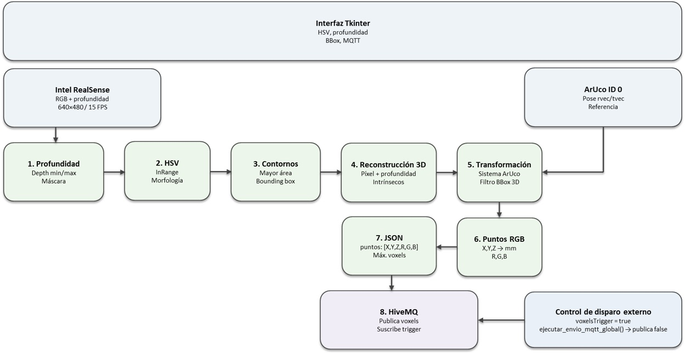
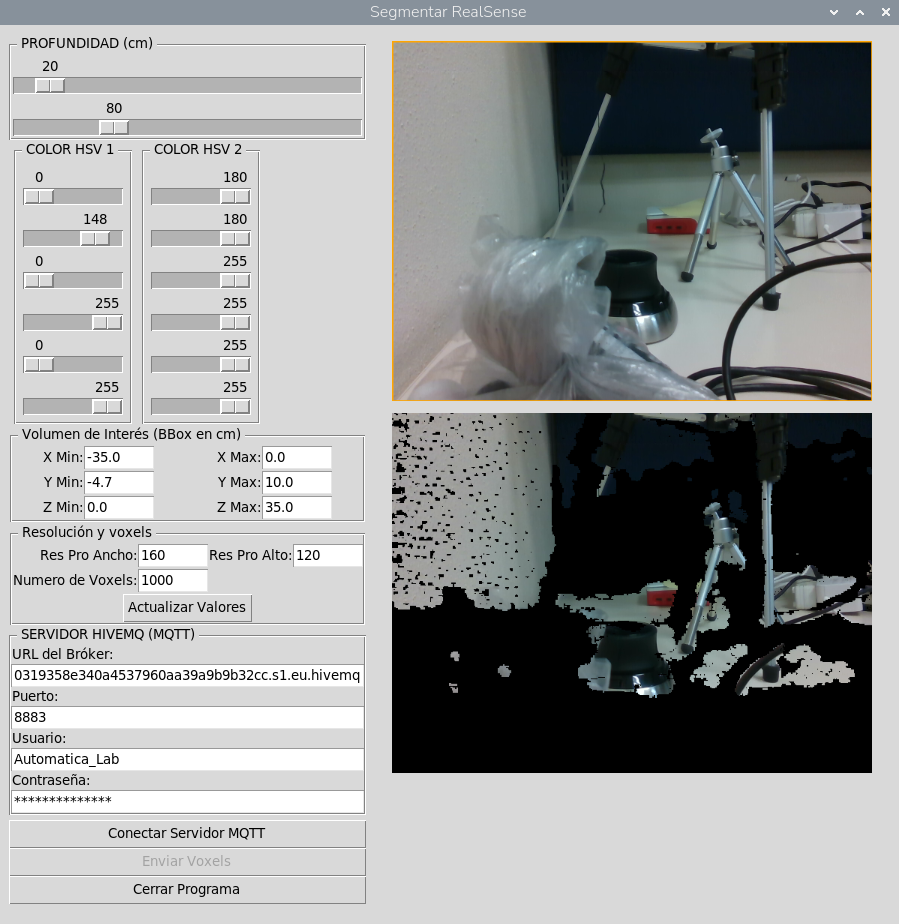

**COBOT PARA INCLUSION:**

**celda robótica teleoperada**

**  
Versión: 7 agosto 2026**

**Subestación: Celda robot**

**Nombre de script: SegmentarRealSense2.py**

**Descripción: Sistema de segmentación 3D con Intel RealSense, OpenCV, ArUco y MQTT/HiveMQ**

# 1\. Resumen del sistema

La aplicación captura simultáneamente imagen RGB y profundidad mediante una cámara Intel RealSense. La profundidad se utiliza para limitar la escena a un intervalo configurable; posteriormente se aplica segmentación por color en espacio HSV para dos clases de objeto. La máscara resultante se reduce a una resolución configurable, se obtienen los contornos y bounding boxes, y se conserva la máscara de los objetos detectados.

Un marcador ArUco de 5 cm funciona como referencia espacial. A partir de su pose estimada mediante PnP se establece un sistema de coordenadas relativo al marcador. Cada píxel segmentado con profundidad válida se reproyecta desde coordenadas de cámara hacia coordenadas 3D relativas al ArUco y se filtra mediante un volumen de interés (bounding box 3D). Finalmente, los puntos se convierten a milímetros y se acompañan de sus componentes RGB.

La lista de puntos se serializa como JSON y se publica en el tópico MQTT voxels. El programa se suscribe a voxelsTrigger; cuando recibe un valor verdadero, dispara el envío y posteriormente restablece el trigger a false.

# 2\. Arquitectura funcional

| Módulo                         | Responsabilidad                                                                        |
| ------------------------------ | -------------------------------------------------------------------------------------- |
| Intel RealSense / pyrealsense2 | Captura RGB y profundidad a 640×480, 15 FPS; alineación profundidad-color.             |
| OpenCV                         | Filtrado, HSV, morfología, contornos, ArUco, PnP y proyección 3D→2D.                   |
| Tkinter                        | Interfaz de usuario, sliders, campos de configuración y visualización.                 |
| Transformación 3D              | Conversión píxel+profundidad → coordenadas de cámara → coordenadas relativas al ArUco. |
| MQTT / Paho                    | Conexión segura a HiveMQ, suscripción al trigger y publicación de voxels.              |
| JSON                           | Serialización del arreglo de puntos para el payload MQTT.                              |

# 3\. Inicialización de cámara y calibración

La cámara se configura con dos streams de 640×480 a 15 FPS: profundidad en formato z16 y color en BGR. Al iniciar el pipeline se obtiene el factor de escala de profundidad del sensor y se crea una alineación hacia el stream de color. También se recuperan los parámetros intrínsecos fx, fy, ppx y ppy, además de los coeficientes de distorsión.

La referencia ArUco usa el diccionario DICT_4X4_50 y un marcador físico de 0.05 m. Sus cuatro esquinas se utilizan con solvePnP/IPPE_SQUARE para estimar rotación (rvec) y traslación (tvec). La pose se suaviza con un filtro exponencial con alpha=0.1.

# 4\. Segmentación de profundidad

En cada iteración, la profundidad se convierte a metros multiplicando los valores del frame por depth_scale. Los sliders de profundidad están expresados en centímetros y se convierten a metros. Se genera una máscara binaria donde cada píxel es válido si cumple depth_min ≤ depth ≤ depth_max. La imagen RGB se filtra con esta máscara.

Los valores iniciales son 20 cm como mínimo y 80 cm como máximo.

# 5\. Segmentación por color HSV

La imagen filtrada por profundidad se suaviza con un Gaussian Blur de 5×5 y se transforma de BGR a HSV. Para cada uno de los dos objetos se aplica cv2.inRange con límites HSV configurables. Después se realizan operaciones morfológicas: cierre con dos iteraciones y apertura con una iteración, usando un kernel de 5×5.

Para cada clase se buscan contornos externos. Solo se conserva el contorno de mayor área si su área es superior a 10 píxeles. Se genera una máscara rellena y su boundingRect. Las máscaras se combinan mediante OR.

# 6\. Reducción de resolución y bounding boxes

La resolución de procesamiento por defecto es 160×120, mientras que la captura permanece en 640×480. La máscara y la imagen se reducen a la resolución baja; posteriormente la máscara final se escala de nuevo a la resolución original solamente para visualizar el resultado. Los datos enviados corresponderán a la resolución de procesamiento.

Los bounding boxes calculados a 160×120, se escalan proporcionalmente para dibujarlos sobre la imagen de 640×480.

# 7\. Sistema de coordenadas 3D basado en ArUco

Para cada píxel segmentado de la máscara de baja resolución se calcula la posición 3D en el sistema de cámara. El píxel de baja resolución se corresponde con un píxel de 640×480; se toma de ahí la profundidad alineada.

Con los intrínsecos se realiza la retroproyección pinhole:

**X = (u − ppx) · Z / fx | Y = (v − ppy) · Z / fy**

El punto se transforma al sistema de cordenadas del ArUco mediante la inversa de la matriz de rotación estimada: P_aruco = Rᵀ · (P_cam − tvec). El punto se acepta únicamente si X, Y y Z están dentro del volumen de interés.

Aunque los campos del BBox se etiquetan en cm, los puntos enviados se convierten finalmente a milímetros.

# 8\. Formato de datos generado

Cada punto enviado tiene seis valores:

| Índice | Campo | Unidad / rango | Descripción                    |
| ------ | ----- | -------------- | ------------------------------ |
| 0      | X     | mm             | Coordenada X relativa al ArUco |
| 1      | Y     | mm             | Coordenada Y relativa al ArUco |
| 2      | Z     | mm             | Coordenada Z relativa al ArUco |
| 3      | R     | 0-255          | Componente roja                |
| 4      | G     | 0-255          | Componente verde               |
| 5      | B     | 0-255          | Componente azul                |

Payload MQTT conceptual:

{"puntos": \[\[x_mm, y_mm, z_mm, r, g, b\], ...\]}

# 9\. Comunicación MQTT con HiveMQ

La interfaz permite configurar URL, puerto, usuario y contraseña. El puerto 8883 activa TLS mediante tls_set(). La conexión se ejecuta en un hilo daemon. Paho inicia su loop de red y se suscribe a voxelsTrigger con QoS 1.

## Flujo de disparo remoto

1. HiveMQ recibe/publica un mensaje en voxelsTrigger.

2. El callback decodifica el payload.

3. Si el valor representa true, se lanza ejecutar_envio_mqtt_global() en un hilo.

4. El programa publica false en voxelsTrigger con QoS 1 y retain=True.

## Flujo de publicación

ejecutar_envio_mqtt_global() obtiene la lista 3D, comprueba que MQTT esté activo, crea el JSON y publica el mensaje en voxels con QoS 0.

# 10\. Interfaz de usuario

| Control                     | Valor inicial                   |
| --------------------------- | ------------------------------- |
| Profundidad mínima / máxima | 20 / 80 cm                      |
| HSV objeto 1                | H 0-148; S 0-255; V 0-255       |
| HSV objeto 2                | H 180-180; S 255-255; V 255-255 |
| BBox X                      | −35 a 0 cm                      |
| BBox Y                      | −4.7 a 10 cm                    |
| BBox Z                      | 0 a 35 cm                       |
| Resolución de procesamiento | 160×120                         |
| Máximo de voxels            | 1000                            |

# 11\. Flujo de ejecución

Al iniciar el programa se crea la ventana Tkinter, se inicializa la cámara, se carga la calibración, se prepara el detector ArUco y se construyen los controles. Después se inicia el bucle periódico de captura.

En cada ciclo: captura → alineación RGB/profundidad → máscara de profundidad → segmentación HSV → contornos/bounding boxes → detección y filtrado de pose ArUco → actualización de la interfaz. El siguiente ciclo se programa aproximadamente 66 ms después mediante root.after(), equivalente a una cadencia objetivo cercana a 15 Hz.

El envío MQTT no ocurre automáticamente en cada cuadro. Se dispara mediante el botón Enviar Voxels o mediante voxelsTrigger.

# 12\. Funciones principales

| Función                      | Propósito                                                                 |
| ---------------------------- | ------------------------------------------------------------------------- |
| \__init__                    | Inicializa cámara, calibración, ArUco, interfaz y estado.                 |
| crear_sliders                | Construye controles HSV, profundidad, BBox, resolución y MQTT.            |
| actualizar_valores_bbox      | Valida y aplica BBox, resolución y máximo de voxels.                      |
| dibujar_bbox_3d              | Proyecta las ocho esquinas del volumen 3D sobre la imagen.                |
| calcular_mapa_relativo_aruco | Convierte píxeles segmentados a puntos 3D relativos al ArUco y añade RGB. |
| procesar_color_y_aruco       | Detecta ArUco, estima/suaviza pose y realiza segmentación HSV.            |
| bucle                        | Captura frames, aplica segmentación y actualiza visualización.            |
| gestionar_conexion_mqtt      | Conecta/desconecta HiveMQ y configura la suscripción al trigger.          |
| ejecutar_envio_mqtt_global   | Genera el JSON y publica los puntos en voxels.                            |
| salir                        | Detiene la cámara y cierra la aplicación.                                 |

# 13\. Dependencias

- tkinter
- opencv-python / cv2
- numpy
- pyrealsense2
- Pillow
- paho-mqtt
- json (stdlib)
- threading (stdlib)

En Raspberry Pi 5 también debe estar disponible el soporte del sistema para la cámara Intel RealSense y una instalación compatible de pyrealsense2/OpenCV.

# 14\. Referencia al código fuente

La configuración de cámara, resolución y escala aparece al inicio de la clase. El cálculo de puntos 3D se concentra en calcular_mapa_relativo_aruco; la segmentación y detección ArUco están en procesar_color_y_aruco; y la publicación MQTT se realiza en ejecutar_envio_mqtt_global.

El bloque de transformación 3D reconstruye X/Y/Z y almacena RGB. El bloque MQTT gestiona la conexión, suscripción a voxelsTrigger y publicación del JSON en voxels.