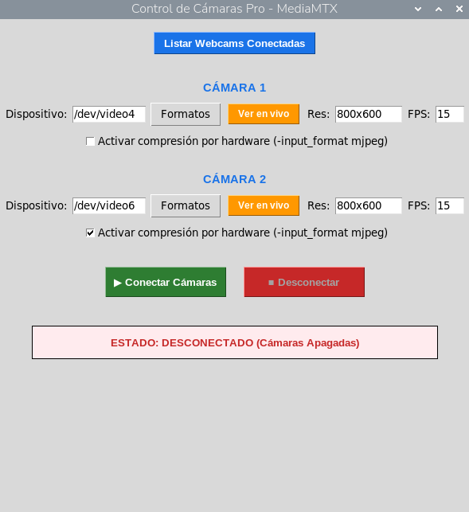

**COBOT PARA INCLUSION:**

**celda robótica teleoperada**

**  
Versión: 7 agosto 2026**

**Subestación: Celda robot**

**Nombre de script: camaras3.py**

**Descripción: Gestión de dos cámaras USB y streaming RTSP mediante MediaMTX en Raspberry Pi 5**

# 1\. Objetivo

camaras3.py proporciona una interfaz gráfica para configurar dos cámaras conectadas a una Raspberry Pi 5, guardar sus parámetros de captura en un archivo mediamtx.yml y arrancar/detener un servidor MediaMTX. MediaMTX ejecuta procesos FFmpeg para capturar cada dispositivo V4L2, codificar el video H.264 y publicar cada cámara como un flujo RTSP independiente.

# 2\. Arquitectura del sistema

El programa Python no realiza directamente la captura continua de imágenes. Actúa como gestor: modifica la configuración de MediaMTX y controla el proceso mediamtx. La captura y codificación son ejecutadas por FFmpeg, mientras que MediaMTX gestiona los paths RTSP y el servidor de streaming.

| Componente     | Tecnología                     | Responsabilidad                                         |
| -------------- | ------------------------------ | ------------------------------------------------------- |
| Raspberry Pi 5 | Linux / Python                 | Ejecuta la interfaz y los procesos de streaming.        |
| Cámara 1       | V4L2 /dev/video0 (por defecto) | Fuente de video para el path webcam.                    |
| Cámara 2       | V4L2 /dev/video2 (por defecto) | Fuente de video para el path webcam2.                   |
| FFmpeg         | V4L2 → H.264 → RTSP            | Captura, codifica y publica cada cámara hacia MediaMTX. |
| MediaMTX       | Servidor RTSP                  | Recibe los publishers locales y expone los streams.     |
| MPlayer        | Cliente RTSP opcional          | Permite visualizar cada stream local desde la interfaz. |
| mediamtx.yml   | YAML                           | Configuración persistente y modificable de los paths.   |

# 3\. Rutas de archivos

El script contempla dos modos de ejecución: Python normal y aplicación empaquetada. Si se ejecuta como ejecutable (sys.frozen), sys.\_MEIPASS se utiliza como base interna para el binario mediamtx, mientras que la carpeta del ejecutable se utiliza como base externa para mediamtx.yml. En ejecución normal, ambos se resuelven respecto al directorio del script.

Binario MediaMTX: mediamtx

Configuración editable: mediamtx.yml

# 4\. Configuración inicial de las cámaras

| Cámara | Dispositivo | Resolución | FPS | MJPEG       |
| ------ | ----------- | ---------- | --- | ----------- |
| 1      | /dev/video0 | 1280×720   | 30  | Desactivado |
| 2      | /dev/video2 | 1280×720   | 30  | Activado    |

Los valores son iniciales y pueden modificarse desde la interfaz. La opción MJPEG añade -input_format mjpeg al comando FFmpeg.

# 5\. Descubrimiento y capacidades de dispositivos

El botón 'Listar Webcams Conectadas' ejecuta v4l2-ctl --list-devices y presenta la salida en una ventana de texto. Cada cámara dispone además de un botón 'Formatos' que ejecuta v4l2-ctl --device=&lt;dispositivo&gt; --list-formats-ext. El resultado se procesa para mostrar formatos de píxel, resoluciones discretas e intervalos/FPS.

Antes de consultar capacidades, el script verifica que la ruta /dev/videoX exista. Los errores se muestran mediante messagebox.

# 6\. Generación de la configuración MediaMTX

Al pulsar 'Conectar Cámaras', save_parameters_to_yml() toma los valores actuales de la interfaz y modifica mediamtx.yml. Se conserva la configuración existente y se asegura la existencia de la sección paths.

Se generan dos paths:

- webcam: stream de la cámara 1.
- webcam2: stream de la cámara 2.

Cada path utiliza runOnInit y runOnInitRestart=True. Por tanto, MediaMTX ejecuta el comando FFmpeg al iniciar el path y puede reiniciarlo si termina.

# 7\. Comandos FFmpeg

El comando generado sigue esta estructura conceptual:

**ffmpeg -f v4l2 \[-input_format mjpeg\] -video_size RES -framerate FPS -i DEVICE -c:v libx264 -preset ultrafast -tune zerolatency -f rtsp rtsp://localhost:\$RTSP_PORT/\$MTX_PATH**

Los parámetros \$RTSP_PORT y \$MTX_PATH son variables proporcionadas por MediaMTX al proceso runOnInit. Esto permite que el mismo patrón de comando se reutilice para ambos paths.

El encoder seleccionado es libx264 con preset ultrafast y tune zerolatency, priorizando baja latencia sobre eficiencia de compresión.

# 8\. Flujo de inicio del streaming

1. 1\. El usuario configura dispositivo, resolución, FPS y MJPEG.
2. 2\. El programa escribe/actualiza mediamtx.yml.
3. 3\. Se inicia el binario mediamtx como proceso hijo.
4. 4\. MediaMTX lee los paths webcam y webcam2.
5. 5\. Para cada path ejecuta el comando FFmpeg definido en runOnInit.
6. 6\. FFmpeg captura la cámara mediante V4L2.
7. 7\. FFmpeg codifica el video en H.264.
8. 8\. FFmpeg publica el stream RTSP hacia MediaMTX.
9. 9\. MediaMTX deja disponibles los streams para clientes RTSP.

# 9\. URLs de streaming local

| Cámara   | URL RTSP local                |
| -------- | ----------------------------- |
| Cámara 1 | rtsp://127.0.0.1:8554/webcam  |
| Cámara 2 | rtsp://127.0.0.1:8554/webcam2 |

El script utiliza estas mismas URLs para la previsualización mediante MPlayer. Para clientes remotos, 127.0.0.1 debe sustituirse por la dirección IP de la Raspberry Pi y debe existir conectividad hacia el puerto RTSP.

# 10\. Previsualización con MPlayer

Los botones 'Ver en vivo' lanzan MPlayer como proceso independiente. El comando usa -nocache, -framedrop y -fps 30 para favorecer una reproducción con baja latencia. La aplicación Python no queda bloqueada porque utiliza subprocess.Popen().

Si MPlayer no está instalado, se muestra un mensaje indicando que puede instalarse mediante el gestor de paquetes del sistema.

# 11\. Carga de configuración existente

Al iniciar la aplicación, load_current_config() intenta leer mediamtx.yml. Si encuentra runOnInit en los paths webcam y webcam2, analiza el comando para recuperar automáticamente el dispositivo, resolución, FPS y estado de MJPEG. Esto permite que la interfaz refleje la configuración guardada anteriormente.

# 12\. Detención del streaming

Al pulsar 'Desconectar' o al cerrar la ventana, disconnect_cameras() envía SIGTERM al proceso MediaMTX y espera a que termine. Después limpia la referencia al proceso y actualiza el estado visual a 'DESCONECTADO (Cámaras Apagadas)'.

# 13\. Interfaz gráfica

La interfaz Tkinter tiene una ventana de 590×620 píxeles. Incluye herramientas de descubrimiento, configuración independiente para cada cámara, botones de consulta de formatos, previsualización, conexión/desconexión y un panel de estado.

- Listar Webcams Conectadas
- Configuración de Cámara 1
- Configuración de Cámara 2
- Formatos soportados
- Ver en vivo
- Conectar Cámaras
- Desconectar
- Panel de estado

# 14\. Dependencias

- Python 3
- tkinter
- PyYAML (yaml)
- FFmpeg
- MediaMTX (binario mediamtx)
- v4l2-ctl
- MPlayer (solo para previsualización)
- Drivers V4L2 de las cámaras

# 15\. Puesta en marcha recomendada en Raspberry Pi 5

1. Conectar ambas cámaras y verificar qué nodos /dev/videoX corresponden a cada una.
2. Usar 'Listar Webcams Conectadas' para confirmar los dispositivos.
3. Consultar 'Formatos' para verificar resoluciones, formatos y FPS soportados.
4. Configurar resolución y FPS compatibles con las cámaras.
5. Activar MJPEG únicamente cuando la cámara lo soporte y sea conveniente para reducir carga de captura USB.
6. Guardar/iniciar mediante 'Conectar Cámaras'.
7. Comprobar el estado de MediaMTX y probar los streams RTSP.
8. Usar 'Ver en vivo' para verificar cada cámara localmente.

# 16\. Consideraciones de rendimiento

**Codificación:** libx264 ultrafast reduce el coste computacional, pero sigue requiriendo CPU. Dos cámaras a 1280×720 y 30 FPS pueden representar una carga considerable.

**USB:** La capacidad real depende del bus USB, formato de captura y cámaras. MJPEG puede disminuir el ancho de banda de transporte frente a formatos sin comprimir.

**Latencia:** tune=zerolatency, -nocache y -framedrop están orientados a minimizar latencia, aunque la latencia final también depende de red y cliente.

**Estabilidad:** runOnInitRestart=True permite recuperar procesos FFmpeg que terminen inesperadamente.

**Persistencia:** mediamtx.yml se modifica directamente. Conviene mantener una copia de respaldo antes de realizar cambios automáticos.

# 17\. Seguridad y operación

El script publica los streams mediante RTSP. Si MediaMTX queda accesible desde otras interfaces de red, se recomienda controlar firewall, segmentación de red y autenticación según la configuración de MediaMTX. La configuración actual del script utiliza URLs locales para la publicación FFmpeg y para la previsualización.

# 18\. Funciones principales

| Función                  | Responsabilidad                                                     |
| ------------------------ | ------------------------------------------------------------------- |
| \__init_\_()             | Inicializa GUI, rutas, parámetros por defecto y carga mediamtx.yml. |
| create_widgets()         | Construye la interfaz de configuración y controles.                 |
| play_local_video()       | Lanza MPlayer sobre un path RTSP local.                             |
| show_all_devices()       | Lista dispositivos V4L2 con v4l2-ctl.                               |
| check_cam_capabilities() | Consulta y presenta formatos/resoluciones/FPS.                      |
| load_current_config()    | Lee runOnInit de mediamtx.yml y recupera parámetros.                |
| save_parameters_to_yml() | Genera los comandos FFmpeg y actualiza los paths MediaMTX.          |
| connect_cameras()        | Guarda configuración e inicia el proceso MediaMTX.                  |
| disconnect_cameras()     | Detiene MediaMTX mediante SIGTERM.                                  |
| on_closing()             | Cierra el streaming y destruye la ventana.                          |

# 19\. Observaciones técnicas

**Gestión de rutas:** El uso de sys.\_MEIPASS y la carpeta externa permite distribuir el ejecutable y mantener mediamtx.yml modificable.

**Configuración YAML:** save_parameters_to_yml() conserva el resto de claves existentes y reemplaza/crea únicamente paths.webcam y paths.webcam2.

**Procesos:** El proceso MediaMTX se guarda en self.process; FFmpeg es administrado indirectamente por MediaMTX mediante runOnInit.

**Previsualización:** MPlayer se inicia como proceso separado y no se registra en self.process; por ello desconectar MediaMTX no necesariamente gestiona procesos MPlayer ya abiertos.

**Validación:** El script verifica existencia de dispositivos antes de consultar capacidades, pero no valida de forma anticipada que resolución/FPS introducidos por el usuario sean soportados.

# 20\. Referencia al código fuente

El script analizado es camaras3.py y contiene 295 líneas. La clase principal es MediaMtxManager. El punto de entrada crea la ventana Tkinter, instancia MediaMtxManager y registra un callback para cerrar ordenadamente el streaming.