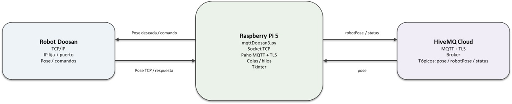
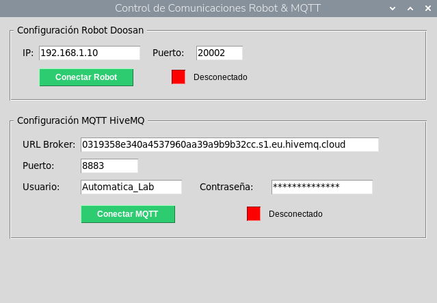

**COBOT PARA INCLUSION:**

**celda robótica teleoperada**

**  
Versión: 7 agosto 2026**

**Subestación: Celda robot**

**Nombre de script: mqttDoosan3.py**

**Descripción: Puente de comunicación entre un robot Doosan, una Raspberry Pi 5 y un servidor MQTT HiveMQ**

# 1\. Objetivo del sistema

mqttDoosan3.py se ejecuta en una Raspberry Pi 5 y funciona como un puente de comunicación entre un robot Doosan y un broker MQTT de HiveMQ. La Raspberry Pi mantiene dos canales independientes: una conexión TCP/IP mediante socket con el controlador del robot y una conexión MQTT segura con HiveMQ. El programa recibe comandos/poses deseadas desde MQTT, los valida y los coloca en una cola para enviarlos al robot; también recibe telemetría del robot y la publica en MQTT.

# 2\. Arquitectura general

La Raspberry Pi actúa como gateway. El robot Doosan se conecta mediante una dirección IP fija y puerto (por defecto 192.168.1.10:20002). HiveMQ se conecta mediante MQTT sobre TLS; el código usa el puerto 8883 como valor predeterminado en la interfaz. La arquitectura y sus flujos se muestran en el archivo PowerPoint editable que acompaña esta documentación.

# 3\. Componentes

| Componente     | Tecnología      | Función                                                                        |
| -------------- | --------------- | ------------------------------------------------------------------------------ |
| Robot Doosan   | TCP/IP / socket | Recibe la pose/comando deseado y entrega su pose TCP cuando corresponde.       |
| Raspberry Pi 5 | Python          | Gateway que transforma y enruta mensajes entre TCP y MQTT.                     |
| HiveMQ Cloud   | MQTT + TLS      | Broker que recibe telemetría y distribuye la pose deseada.                     |
| Paho MQTT      | paho-mqtt       | Cliente MQTT de la Raspberry Pi.                                               |
| Tkinter        | Python GUI      | Configuración de IP/puerto, credenciales MQTT y estados de conexión.           |
| queue.Queue    | Python          | Comunicación segura entre callbacks MQTT y el hilo de procesamiento del robot. |

# 4\. Comunicación TCP con el robot

El programa crea un socket IPv4 TCP (AF_INET, SOCK_STREAM), habilita SO_REUSEADDR y utiliza un timeout de 3 segundos. Después conecta con la IP y puerto configurados. Una vez conectada la Raspberry Pi, se mantiene un hilo de escucha/gestión para procesar la comunicación con el robot.

El comando enviado al robot tiene siete campos separados por comas y termina con salto de línea:

**dx,dy,dz,rx,ry,rz,pinza\\n**

Los seis primeros valores representan la pose deseada y el séptimo controla la pinza/trigger. Cuando pinza=2.0, el valor se trata como un trigger especial: después de enviar el comando, el programa espera una respuesta del robot y la interpreta como telemetría.

# 5\. Comunicación MQTT con HiveMQ

Al iniciar MQTT, el cliente Paho configura usuario y contraseña, habilita TLS y conecta al broker. Tras conectarse, se suscribe al tópico pose y publica el estado actual del sistema. El loop de red de Paho se ejecuta con loop_start(), por lo que la comunicación MQTT ocurre de forma asíncrona.

Parámetros configurables en la interfaz: URL del broker, puerto, usuario y contraseña.

# 6\. Tópicos MQTT

| Tópico    | Dirección             | QoS                            | Formato / propósito                                                             |
| --------- | --------------------- | ------------------------------ | ------------------------------------------------------------------------------- |
| pose      | HiveMQ → Raspberry Pi | No especificado explícitamente | Lista JSON de 7 valores. Representa la pose deseada y control de pinza/trigger. |
| robotPose | Raspberry Pi → HiveMQ | 0                              | JSON {"robotPose": \[x,y,z,rx,ry,rz,valor\]} con telemetría del robot.          |
| status    | Raspberry Pi → HiveMQ | 1                              | Lista JSON \[robot_status, mqtt_status, 0\].                                    |

# 7\. Flujo de pose deseada: HiveMQ → Robot

1. 1\. HiveMQ entrega un mensaje en el tópico pose.
2. 2\. El callback MQTT decodifica el payload UTF-8 y lo convierte mediante json.loads().
3. 3\. Se exige una lista con al menos siete elementos.
4. 4\. dx, dy y dz se limitan al intervalo −400…400.
5. 5\. rx, ry y rz se limitan al intervalo −10…10.
6. 6\. El séptimo valor se convierte a pinza=0.0/1.0, excepto cuando es exactamente 2.0; en ese caso se conserva como trigger.
7. 7\. El comando validado se coloca en cola_comandos.
8. 8\. El hilo del robot toma el comando y transmite los siete campos al Doosan mediante sendall().

# 8\. Flujo de telemetría: Robot → Raspberry Pi → HiveMQ

1. 1\. El robot entrega una trama TCP delimitada por salto de línea.
2. 2\. La Raspberry Pi acumula fragmentos en un buffer hasta encontrar \\n.
3. 3\. La línea se divide por comas y se convierte a valores numéricos.
4. 4\. La función publicar_telemetria_robot() crea el payload JSON.
5. 5\. El payload se publica en robotPose con QoS 0.

# 9\. Trigger de telemetría mediante pinza=2.0

El valor 2.0 en el séptimo campo tiene una función especial. No representa el estado binario normal de la pinza. El código lo conserva como 2.0 y, después de enviar el comando al robot, ejecuta recv(1024) para esperar una trama de respuesta. Si la respuesta contiene al menos siete campos, se convierte a floats y se publica inmediatamente en robotPose.

Este mecanismo permite que un mensaje MQTT pueda solicitar al robot que envíe su pose actual sin crear un segundo protocolo de control.

# 10\. Estado del sistema

El tópico status publica una lista de tres valores: \[robot_status, mqtt_status, 0\]. robot_status vale 1 si existe un socket activo y 0 si no; mqtt_status vale 1 cuando se publica el estado desde un cliente MQTT conectado.

Al cerrar MQTT, el programa intenta publicar \[0,0,0\] antes de detener el loop y desconectar el cliente.

# 11\. Concurrencia y colas

El programa separa la interfaz gráfica, la comunicación MQTT y la comunicación con el robot mediante hilos y una cola. cola_comandos permite que el callback MQTT no tenga que escribir directamente sobre el socket TCP. cola_config_robot transporta la configuración de IP/puerto desde la interfaz hacia el hilo del robot.

El hilo principal del robot revisa continuamente si debe conectarse, obtiene comandos de cola_comandos y gestiona el envío. Si se produce una excepción TCP, el socket se invalida, el indicador se actualiza y el comando se vuelve a colocar en la cola.

# 12\. Reconexión y manejo de errores

Si la conexión TCP falla al iniciar, el hilo espera aproximadamente 3 segundos antes de volver a intentar. Si el socket cae durante el procesamiento, se marca como None y el ciclo puede reconstruir la conexión. MQTT actualiza el indicador mediante on_connect y on_disconnect; un error de conexión se muestra mediante messagebox.

# 13\. Interfaz gráfica

La ventana se denomina 'Control de Comunicaciones Robot & MQTT' y tiene una resolución fija de 640×420. Incluye un bloque de configuración del robot Doosan con IP y puerto, y un bloque de configuración MQTT con URL, puerto, usuario y contraseña. Indicadores visuales muestran el estado de cada enlace.

# 14\. Parámetros iniciales observados

| Parámetro      | Valor               | Nota                                |
| -------------- | ------------------- | ----------------------------------- |
| IP Doosan      | 192.168.1.10        | Editable en la interfaz.            |
| Puerto Doosan  | 20002               | Editable en la interfaz.            |
| Puerto MQTT    | 8883                | Configurado para TLS.               |
| Timeout TCP    | 3 s                 | Aplicado al socket.                 |
| Keepalive MQTT | 60 s                | Usado en connect().                 |
| pose           | Lista de ≥7 valores | Se valida y limita antes de enviar. |
| robotPose      | JSON con robotPose  | Telemetría publicada con QoS 0.     |
| status         | JSON de 3 valores   | Publicado con QoS 1.                |

# 15\. Dependencias

- Python 3
- paho-mqtt
- tkinter
- socket (stdlib)
- threading (stdlib)
- queue (stdlib)
- json (stdlib)
- time (stdlib)

# 16\. Instalación y puesta en marcha recomendada

1. Verificar conectividad de red entre Raspberry Pi y controlador Doosan.
2. Configurar IP y puerto TCP del robot en la interfaz.
3. Instalar paho-mqtt y verificar que Tkinter esté disponible.
4. Configurar URL, puerto, usuario y contraseña de HiveMQ.
5. Conectar MQTT y comprobar que el indicador MQTT cambie a CONECTADO.
6. Conectar el robot y comprobar el indicador TCP.
7. Probar primero un mensaje de pose con valores seguros y dentro de los límites aceptados.
8. Verificar que robotPose recibe telemetría y que status refleja correctamente el estado de los enlaces.

# 17\. Seguridad y recomendaciones

**Credenciales:** No almacenar usuario/contraseña de HiveMQ directamente en el código fuente. Usar variables de entorno, archivo protegido o gestor de secretos.

**Red del robot:** Mantener la red TCP del robot aislada o controlada mediante reglas de firewall/VLAN.

**Validación:** Los límites implementados ayudan a evitar comandos fuera de rango, pero deben validarse también contra los límites reales del robot y del proceso.

**MQTT QoS:** robotPose utiliza QoS 0. Si la telemetría requiere garantía de entrega, evaluar QoS 1 según las necesidades del sistema.

**Confirmación de comandos:** Para aplicaciones críticas, considerar un tópico o mecanismo de ACK para confirmar que el Doosan recibió y ejecutó el comando.

**Formato:** Documentar formalmente unidades de dx/dy/dz y rx/ry/rz según el programa DRL del robot, ya que el script no define esas unidades por sí mismo.

# 18\. Funciones principales

| Función                        | Responsabilidad                                                           |
| ------------------------------ | ------------------------------------------------------------------------- |
| conectar_robot_fisico()        | Crea y conecta el socket TCP y arranca la escucha.                        |
| hilo_procesador_robot()        | Gestiona conexión, cola de comandos, transmisión y lectura de respuestas. |
| receive_robot_position()       | Procesa tramas TCP delimitadas por salto de línea y publica telemetría.   |
| publicar_telemetria_robot()    | Publica robotPose en MQTT.                                                |
| publicar_estado_sistema()      | Publica el estado de robot y MQTT.                                        |
| iniciar_mqtt_broker()          | Configura cliente Paho, TLS, callbacks, conexión y suscripción a pose.    |
| detener_mqtt_broker()          | Publica estado de cierre y desconecta MQTT.                               |
| AppControl                     | Interfaz gráfica y control de conexiones.                                 |
| toggle_robot() / toggle_mqtt() | Activa o desactiva cada enlace.                                           |
| al_cerrar_ventana()            | Realiza el cierre ordenado de hilos, socket y MQTT.                       |

# 19\. Referencia al código fuente

El código fuente organiza el sistema en cuatro bloques principales: librerías/variables, comunicación con el robot, gestión MQTT e interfaz gráfica. La inicialización arranca hilo_procesador_robot() y posteriormente crea la ventana Tkinter y entra en root.mainloop().