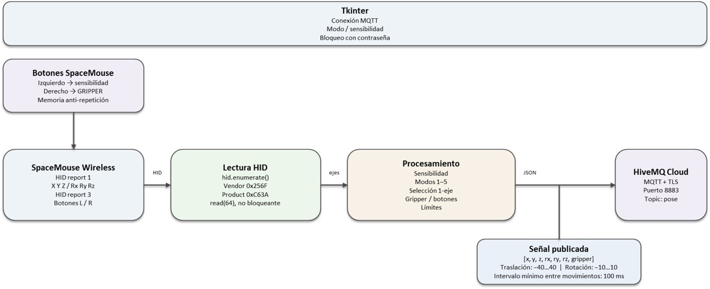
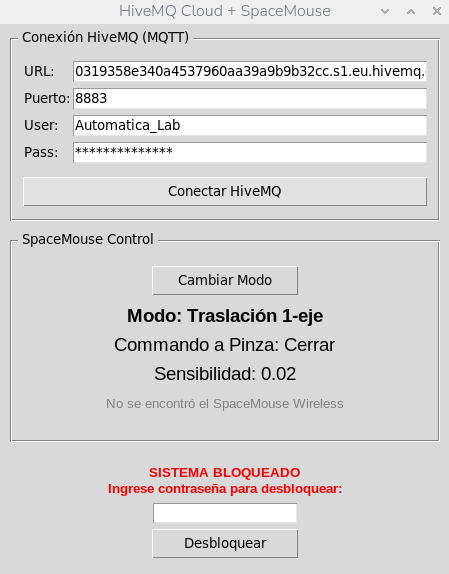

**COBOT PARA INCLUSION:**

**estación de operador**

**Versión: 7 agosto 2026**

**Subestación: Celda robot**

**Nombre de script: SmouseMqtt.py**

**Descripción: Gestión de SpaceMouse 3Dconnexion y envío de señales de control mediante MQTT/HiveMQ**

# 1\. Objetivo del sistema

SmouseMqtt.py se ejecuta en una Raspberry Pi 5 y funciona como interfaz entre un SpaceMouse Wireless de 3Dconnexion y un servidor MQTT HiveMQ Cloud. El programa detecta el dispositivo mediante HID, lee sus reportes de movimiento y botones, transforma las señales de los seis ejes, aplica modos de operación y límites, y publica una pose de control en el tópico MQTT 'pose'. También publica el estado del gripper cuando cambia su estado.

# 2\. Arquitectura functional

| Componente          | Tecnología  | Responsabilidad                                                       |
| ------------------- | ----------- | --------------------------------------------------------------------- |
| SpaceMouse Wireless | USB HID     | Genera reportes de movimiento y botones.                              |
| Raspberry Pi 5      | Python      | Lee HID, procesa señales, aplica modos/límites y publica MQTT.        |
| hidapi / hid        | Python HID  | Enumera, abre y lee el dispositivo por Vendor/Product ID.             |
| Tkinter             | Python GUI  | Configura MQTT, muestra modo/sensibilidad/gripper y gestiona bloqueo. |
| Paho MQTT           | MQTT        | Conecta con HiveMQ mediante TLS y publica comandos.                   |
| HiveMQ Cloud        | Broker MQTT | Recibe tópico pose y estado de gripper.                               |

# 3\. Interfaz

# 4\. Identificación del SpaceMouse

El dispositivo se localiza mediante USB Vendor ID 0x256F y Product ID 0xC63A. El programa recorre hid.enumerate(), obtiene la ruta del primer dispositivo coincidente, abre dicha ruta y activa lectura no bloqueante. Si no encuentra el dispositivo, actualiza el mensaje de estado y termina el hilo de fondo.

La lectura utiliza device.read(64), por lo que se esperan reportes HID de hasta 64 bytes.

# 5\. Procesamiento de los reportes HID

El byte data\[0\] se utiliza como report_id. El programa reconoce principalmente dos reportes: report_id=1 para movimiento y report_id=3 para botones.

| Reporte | Datos        | Uso                                        |
| ------- | ------------ | ------------------------------------------ |
| 1       | data\[1:13\] | 6 grados de libertad: X, Y, Z, Rx, Ry, Rz. |
| 3       | data\[1\]    | Bits de botones izquierdo y derecho.       |

# 6\. Conversión de los seis ejes

Los valores de los ejes se interpretan como enteros signed little-endian de 16 bits y se multiplican por sensibilidad. El eje Z de traslación invierte su signo. Para rotación, Rz también invierte su signo, mientras Rx y Ry mantienen el signo.

**X = sensibilidad · int16(data\[3:5\])**

**Y = sensibilidad · int16(data\[1:3\])**

**Z = −sensibilidad · int16(data\[5:7\])**

**Rx = sensibilidad · int16(data\[7:9\]) | Ry = sensibilidad · int16(data\[9:11\]) | Rz = −int16(data\[11:13\])**

# 7\. Modos de operación

| Modo | Nombre           | Señales activas                                            |
| ---- | ---------------- | ---------------------------------------------------------- |
| 1    | Normal           | Traslación + rotación.                                     |
| 2    | Traslación       | X, Y, Z.                                                   |
| 3    | Traslación 1-eje | X, Y o Z; conserva únicamente el eje de mayor magnitud.    |
| 4    | Rotación         | Rx, Ry, Rz.                                                |
| 5    | Rotación 1-eje   | Rx, Ry o Rz; conserva únicamente el eje de mayor magnitud. |

El modo inicial es 3. El botón Cambiar Modo recorre cíclicamente los valores 1 a 5.

# 8\. Selección de un solo eje

En los modos 3 y 5 el programa compara los valores absolutos de los tres ejes del grupo correspondiente. El eje con mayor magnitud se conserva y los otros dos se ponen a cero. Las comparaciones utilizan >=, por lo que si existe empate se pueden ejecutar varias condiciones sucesivamente; la última condición verdadera puede determinar qué eje queda activo.

# 9\. Acotación de señales

Antes de publicar, las señales de traslación se limitan al rango −40…40 y las señales de rotación al rango −10…10.

| Grupo      | Rango aplicado | Variables  |
| ---------- | -------------- | ---------- |
| Traslación | −40 a +40      | x, y, z    |
| Rotación   | −10 a +10      | rx, ry, rz |

# 10\. Frecuencia mínima de publicación

El hilo utiliza INTERVALO_MINIMO = 0.1 s. Por lo tanto, los reportes de movimiento no generan publicaciones de pose con una separación menor a aproximadamente 100 ms, equivalente a un máximo teórico de 10 publicaciones por segundo para ese flujo. El bucle también incorpora time.sleep(0.001).

# 11\. Formato del mensaje MQTT de pose

Cada actualización de movimiento se publica en el tópico pose como un arreglo JSON de siete valores:

**\[x, y, z, rx, ry, rz, gripper\]**

El séptimo elemento es gripper_numerico. Inicialmente vale 0.0 y cambia a 1.0 cuando se alterna el estado del gripper. Al cambiar el estado también se publica un mensaje independiente en el tópico configurado por MQTT_TOPIC_GRIPPER.

# 12\. Control del gripper

El botón derecho del SpaceMouse realiza un toggle del estado GRIPPER. Para evitar múltiples cambios mientras el botón permanece presionado, se utiliza boton_derecho_presionado como memoria del estado anterior.

- GRIPPER=True → se publica \[0,0,0,0,0,0,0.0\].
- GRIPPER=False → se publica \[0,0,0,0,0,0,1.0\].
- Después se publica el estado mediante un JSON con la clave gripper.

# 13\. Control mediante botón izquierdo

El botón izquierdo cambia la sensibilidad de manera cíclica. El cambio solo se produce al detectar una nueva pulsación, no mientras el botón permanece mantenido.

**Secuencia:** 0.02 → 0.1 → 0.2 → 0.4 → 1.0 → 0.02

# 14\. Bloqueo de seguridad

El sistema inicia bloqueado. Mientras esta_bloqueado=True, el hilo HID no procesa movimientos ni botones. El usuario debe introducir la contraseña configurada en CONTRASENA para desbloquear el control.

El bloqueo funciona como una habilitación lógica del procesamiento. Al volver a bloquear, las señales del SpaceMouse dejan de procesarse aunque el dispositivo permanezca conectado.

# 15\. Comunicación con HiveMQ

El cliente Paho se configura con TLS mediante tls_set(). La interfaz permite introducir URL, puerto, usuario y contraseña. Al conectar, se utiliza connect() con keepalive de 60 segundos y se inicia loop_start() para mantener el procesamiento MQTT en segundo plano.

El puerto inicial es 8883, correspondiente al uso de MQTT sobre TLS.

# 16\. Hilos y concurrencia

El procesamiento HID y MQTT se ejecuta en hilo_background(), separado del hilo principal de Tkinter. Esto evita que la lectura del SpaceMouse y la comunicación de red bloqueen la interfaz gráfica. La GUI se actualiza cada 100 ms mediante ventana.after().

# 17\. Dependencias

- Python 3
- hid (hidapi / hid-python)
- paho-mqtt
- tkinter
- threading (stdlib)
- time (stdlib)
- json (stdlib)

# 18\. Parámetros principales

| Parámetro        | Valor  | Función                                    |
| ---------------- | ------ | ------------------------------------------ |
| VENDOR_ID        | 0x256F | Identificación USB del dispositivo.        |
| PRODUCT_ID       | 0xC63A | Identificación USB del modelo.             |
| MODO             | 3      | Modo inicial: traslación 1-eje.            |
| sensibilidad     | 0.02   | Escala inicial de movimiento.              |
| INTERVALO_MINIMO | 0.1 s  | Periodo mínimo entre envíos de movimiento. |
| Límite XYZ       | ±40    | Acotación de traslación.                   |
| Límite Rx/Ry/Rz  | ±10    | Acotación de rotación.                     |
| MQTT_PORT        | 8883   | Puerto TLS.                                |
| MQTT_TOPIC_POSE  | pose   | Tópico de comandos de pose.                |

# 19\. Flujo de señales

El flujo principal es: SpaceMouse → HID → interpretación del reporte → conversión de ejes → selección de modo → acotación → construcción del arreglo de siete valores → JSON → MQTT pose → HiveMQ.

En paralelo, los botones permiten modificar sensibilidad, cambiar el modo y alternar el gripper. La interfaz Tkinter solo muestra el estado y gestiona conexión/bloqueo; el procesamiento del dispositivo ocurre en el hilo secundario.

# 20\. Manejo de errores y cierre

Si ocurre IOError durante el acceso HID, el programa informa el error. En el bloque finally intenta cerrar el dispositivo, detiene el loop MQTT y desconecta el cliente. La ventana principal mantiene el hilo background como daemon.

# 21\. Recomendaciones técnicas

**Credenciales:** Las credenciales MQTT y la contraseña de desbloqueo están escritas directamente en el código. Para producción deben trasladarse a configuración segura o variables de entorno.

**Publicación MQTT:** El código no comprueba explícitamente el resultado de publish() y utiliza except: pass en varios puntos; conviene registrar errores y estados de publicación.

**Topic de gripper:** MQTT_TOPIC_GRIPPER se utiliza en el código, pero en el fragmento proporcionado no se observa su definición junto a MQTT_TOPIC_POSE. Debe verificarse antes de ejecutar.

**Seguridad de parada:** El bloqueo evita procesar nuevas señales, pero no publica explícitamente una orden de parada/cero al bloquearse. Para control robótico conviene definir un estado seguro.

**Unidades:** La documentación del consumidor MQTT debe definir las unidades físicas de x/y/z y rx/ry/rz.

**Deadband:** Puede ser útil añadir una zona muerta para evitar pequeñas oscilaciones del SpaceMouse alrededor de cero.

# 22\. Funciones principales

| Función                  | Responsabilidad                                                                            |
| ------------------------ | ------------------------------------------------------------------------------------------ |
| hilo_background()        | Inicializa MQTT/HID, lee reportes del SpaceMouse, procesa ejes/botones y publica mensajes. |
| alternar_conexion_mqtt() | Conecta o desconecta el cliente MQTT desde la interfaz.                                    |
| actualizar_interfaz()    | Actualiza modo, gripper, sensibilidad y mensajes cada 100 ms.                              |
| cambiar_modo()           | Cicla entre los cinco modos de operación.                                                  |
| alternar_bloqueo()       | Bloquea/desbloquea el procesamiento mediante contraseña.                                   |
| accion_boton()           | Callback de un botón Tkinter; actualmente solo imprime un mensaje.                         |

# 23\. Referencia al código fuente

El núcleo de procesamiento se concentra en hilo_background(), donde se implementan la lectura HID, los modos, la sensibilidad, la acotación y las publicaciones MQTT. La interfaz gráfica y el control de seguridad se encuentran en las funciones posteriores.