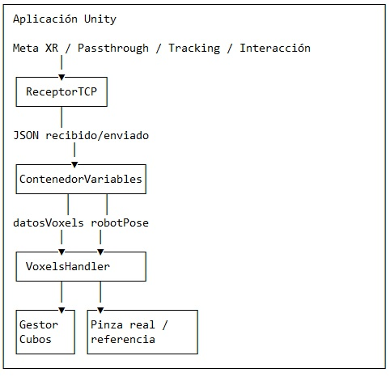
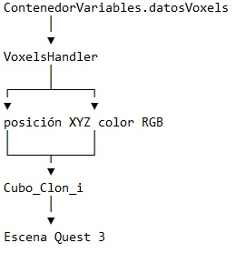
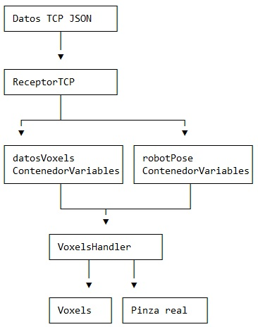

**COBOT PARA INCLUSION:**

**estación de operador**

**Versión: 7 agosto 2026**

**Subestación: Celda robot**

**Nombre de script: XRtest4.apk**

**Descripción: Aplicación Meta Quest 3 - Unity / Meta XR**

# 1\. Alcance y objetivo

Esta documentación describe exclusivamente el proyecto Unity suministrado para ejecutarse en Meta Quest 3. El alcance comprende la aplicación XR, la escena principal, los scripts propios, la representación de voxels, la representación de la pinza real, la interacción con la pinza virtual, el protocolo TCP implementado en el cliente Unity y los componentes auxiliares de interfaz y XR.

La arquitectura global que incluye Raspberry Pi, HiveMQ/MQTT y robot Doosan queda deliberadamente fuera de este documento. En esta fase únicamente se describe la interfaz TCP tal como está implementada dentro del proyecto Quest.

# 2\. Identificación del proyecto

| Elemento            | Valor                                   |
| ------------------- | --------------------------------------- |
| Editor Unity        | 6000.3.6f1                              |
| Plataforma objetivo | Meta Quest 3                            |
| Escena principal    | Assets/Scenes/SceneCobotVoxelsTCP.unity |
| Escena alternativa  | Assets/SceneCobotVoxelsTCPv0.unity      |
| Meta XR SDK         | com.meta.xr.sdk.all 203.0.0             |
| Render Pipeline     | Universal Render Pipeline 17.3.0        |
| Input System        | 1.18.0                                  |
| JSON                | Newtonsoft Json 3.2.2 + JsonUtility     |

# 3\. Descripción funcional

La aplicación combina realidad aumentada y objetos 3D interactivos. El proyecto incluye un modelo de mesa, modelos asociados al robot y al gripper, una referencia espacial y un conjunto de cubos utilizados para representar voxels.

- Recibir por TCP/IP datos JSON que contienen puntos/voxels y una pose de robot.
- Mantener los datos recibidos en variables estáticas accesibles por los componentes de la escena.
- Representar hasta 1500 voxels mediante cubos, usando posición y RGB.
- Actualizar la representación visual de la pinza real a partir de robotPose.
- Permitir la interacción del usuario con una pinza virtual.
- Calcular un desplazamiento objetivo a partir de la posición de la pinza virtual.
- Enviar por TCP comandos de movimiento, apertura/cierre del gripper y trigger de voxels.

# 4\. Arquitectura interna del proyecto

META QUEST 3  

# 5\. Escena principal

La escena documentada es SceneCobotVoxelsTCP.unity. A partir del archivo de escena se identifican, entre otros, los GameObjects propios que alojan los scripts principales.

| GameObject             | Script                      | Función                                             |
| ---------------------- | --------------------------- | --------------------------------------------------- |
| CommTCP                | ReceptorTCP                 | Cliente TCP y generación de comandos JSON.          |
| Variables Globales     | ContenedorVariables         | Inicialización/almacenamiento de datos globales.    |
| AssetsMotionController | VoxelsHandler               | Actualización de voxels y pinza real.               |
| GeneradorCubos         | GestorCubos                 | Generación de cubos para los voxels.                |
| InteraccionMesa        | ControladorManoInteractable | Habilitación/deshabilitación del agarre de la mesa. |
| SimuladorBotonPieza    | SimuladorBoton              | Ejecución automática de una acción UI.              |
| CierreApp              | ExitController              | Cierre de la aplicación.                            |

Además, el proyecto contiene escenas de recuperación y una escena SceneCobotVoxelsTCPv0. Algunos scripts auxiliares aparecen en escenas alternativas/de recuperación; esta documentación funcional se centra en la escena principal.

# 6\. Scripts propios

| Script                    | Responsabilidad                                            |
| ------------------------- | ---------------------------------------------------------- |
| ReceptorTCP.cs            | Comunicación TCP, recepción JSON y envío de comandos.      |
| ContenedorVariables.cs    | Almacenamiento estático de voxels y pose.                  |
| VoxelsHandler.cs          | Procesamiento visual de voxels y pinza real.               |
| GestorCubos.cs            | Creación de la reserva de cubos.                           |
| ControladorAgarre.cs      | Control de HandGrabInteractable y estado visual del botón. |
| SimuladorBoton.cs         | Ejecución periódica automática de un Button.               |
| SeguirHijo.cs             | Seguimiento espacial de un Transform.                      |
| LockRotation.cs           | Bloqueo de rotación mediante botón del controlador.        |
| estabilizarPassthrough.cs | Configuración de refresco/VSync XR.                        |
| ExitController.cs         | Cierre de la aplicación.                                   |

# 7\. ReceptorTCP: conexión y ciclo de recepción

ReceptorTCP implementa el cliente TCP de la aplicación. El puerto configurado es 9999 y la IP puede introducirse mediante un TMP_InputField. Existe una IP por defecto de 192.168.43.114.

La activación del cliente crea un hilo de fondo (BucleClienteTCP). El hilo intenta establecer la conexión y, una vez conectado, obtiene el NetworkStream y ejecuta LeerDatos(). Si se produce un fallo mientras el cliente sigue habilitado, espera 2 segundos y vuelve a intentar la conexión.

La lectura utiliza StreamReader.ReadLine(), por lo que cada mensaje se espera delimitado por un carácter de salto de línea. El hilo se ejecuta fuera del hilo principal de Unity.

# 8\. Modelo JSON recibido

La clase DatosProyecto define dos campos:

{"puntos": \[\[X,Y,Z,R,G,B\], ...\], "robotPose": \[X,Y,Z,RX,RY,RZ\]}

| Campo     | Tipo                  | Tratamiento                                                                    |
| --------- | --------------------- | ------------------------------------------------------------------------------ |
| puntos    | List&lt;List<int&gt;> | Se copia a ContenedorVariables.datosVoxels cuando existe y contiene elementos. |
| robotPose | List&lt;int&gt;       | Se copia a ContenedorVariables.robotPose cuando existe y contiene elementos.   |

La deserialización se realiza mediante Newtonsoft.Json. Los errores de formato JSON se registran como errores de la aplicación.

# 9\. Modelo JSON enviado

La clase DatosParaRaspberry define los campos utilizados para las acciones iniciadas desde Quest.

| Campo                 | Tipo            | Función                                                  |
| --------------------- | --------------- | -------------------------------------------------------- |
| abrirGripper          | bool            | Indica una orden de apertura.                            |
| cerrarGripper         | bool            | Indica una orden de cierre.                              |
| moverRobot            | bool            | Indica que se solicita un movimiento.                    |
| voxelsTrigger         | bool            | Indica una solicitud de actualización/trigger de voxels. |
| coordenadasMoverRobot | List&lt;int&gt; | Vector de seis valores asociado al movimiento.           |

{"abrirGripper":false,"cerrarGripper":false,"moverRobot":true,"voxelsTrigger":false,"coordenadasMoverRobot":\[X,Y,Z,RX,RY,RZ\]}

El JSON se genera con JsonUtility.ToJson(), se añade '\\n', se codifica en UTF-8 y se escribe en el NetworkStream.

# 10\. Comandos disponibles desde Quest

| Método               | moverRobot | Gripper     | Trigger |
| -------------------- | ---------- | ----------- | ------- |
| EnviarTrigger()      | false      | false       | true    |
| BotonAbrirGripper()  | false      | abrir=true  | false   |
| BotonCerrarGripper() | false      | cerrar=true | false   |
| BotonMoverRobot()    | true       | false       | false   |

# 11\. Cálculo de la posición objetivo de la pinza virtual

BotonMoverRobot() transforma la posición de pivoteGripperVirtual al sistema de referencia de referenceAsset. Primero se resta la posición del asset de referencia y se aplica la rotación inversa de dicho asset.

posArucoRobot_Aruco = Quaternion.Inverse(referenceAsset.rotation) \* (pivoteGripperVirtual.position - referenceAsset.position) \* 1000

El código utiliza una escala de 0.001 para interpretar milímetros frente a unidades de Unity; por ello, para obtener la posición en milímetros utiliza el inverso de esa escala.

Posteriormente se aplica la conversión de ejes implementada en el código y se utiliza una posición base posArucoBaseRobot_Aruco = \[340, -561, -28\]. Finalmente se resta robotPose para obtener el desplazamiento.

coordenadasMoverRobot = \[ΔX, ΔY, ΔZ, 0, 0, 0\]

Los tres últimos componentes se fijan en cero. Por tanto, el comando generado conserva explícitamente la orientación actual en lugar de solicitar una nueva orientación.

# 12\. Almacenamiento global: ContenedorVariables

ContenedorVariables utiliza variables estáticas para que distintos componentes puedan compartir los datos.

| Variable     | Tipo                  | Inicialización                                |
| ------------ | --------------------- | --------------------------------------------- |
| datosVoxels  | List&lt;List<int&gt;> | 1500 filas × 6 enteros, inicialmente en cero. |
| numeroVoxels | int                   | 1500.                                         |
| robotPose    | List&lt;int&gt;       | 6 enteros, inicialmente en cero.              |

La inicialización de datosVoxels se ejecuta mediante RuntimeInitializeOnLoadMethod antes de la carga de la escena.

# 13\. GestorCubos

GestorCubos genera en Awake() una lista de 1500 GameObjects. Cada uno recibe MeshFilter y MeshRenderer y utiliza la malla Cube.fbx incorporada en Unity.

- Los cubos se crean como hermanos del cubo de referencia, conservando el mismo padre.
- Se copian posición, rotación y escala locales del cubo de referencia.
- Se reutiliza el material compartido del cubo de referencia cuando está disponible.
- La lista resultante se expone mediante ObtenerListaCubos().

# 14\. VoxelsHandler

VoxelsHandler coordina la actualización de la representación visual de los voxels y de la pinza real.

Al ejecutar OnButtonClick(), obtiene los datos almacenados en ContenedorVariables, solicita un trigger mediante ReceptorTCP y actualiza la lista de cubos.

## 14.1 Transformación de voxels

- Cada voxel se interpreta como \[X,Y,Z,R,G,B\].
- La coordenada Z se invierte: Z' = -Z.
- Las coordenadas se multiplican por 0.001 para pasar de milímetros a unidades de Unity.
- El desplazamiento se rota mediante referenceAsset.transform.rotation.
- R, G y B se convierten a Color32 con alfa 255.
- Los cubos sin datos válidos se vuelven transparentes mediante alfa 0.

# 14.2 Flujo de actualización

# 15\. Representación de la pinza real

VoxelsHandler utiliza pivoteGripperReal para representar la posición del gripper real. La orientación del pivote se iguala a la de referenceAsset.

La posición se obtiene a partir de robotPose y de la posición base \[340, -561, -28\]. El código implementa una transformación de ejes según la relación indicada en sus comentarios: A.x = R.y, A.y = R.z y A.z = -R.x.

coordenadasGripper = \[robotPose\[1\]+(-561), robotPose\[2\]+(-28), -(robotPose\[0\]+340)\]

Finalmente la posición del pivote se expresa respecto de referenceAsset, utilizando la rotación del asset y la escala 0.001.

# 16\. Pinza virtual e interacción XR

ReceptorTCP mantiene la referencia pivoteGripperVirtual. Su posición es utilizada por BotonMoverRobot() como posición objetivo definida por el usuario.

El proyecto utiliza componentes de Meta XR para interacción. ControladorManoInteractable administra un HandGrabInteractable y permite alternar su habilitación desde un botón de UI.

# 17\. ControladorManoInteractable

El script ControladorAgarre.cs contiene la clase ControladorManoInteractable. Su función es sincronizar el estado del HandGrabInteractable con el aspecto de un botón.

| Estado                 | Visual                          |
| ---------------------- | ------------------------------- |
| HandGrab habilitado    | Color verde y texto 'Grabable'. |
| HandGrab deshabilitado | Color rojo y texto 'Bloqueado'. |

# 18\. SimuladorBoton

SimuladorBoton proporciona un modo automático para ejecutar periódicamente el onClick de un Button. Al activarse, cambia la interfaz a 'Parar' y ejecuta el botón cada 0.4 segundos. Al detenerse, restaura la interfaz a 'Automatico' y detiene las corrutinas.

# 19\. SeguirHijo

SeguirHijo conserva un desfase de posición y rotación respecto de assetHijo. El desfase se calcula en Start() y se aplica en LateUpdate(). Este mecanismo permite mantener una relación espacial estable después del tracking XR.

# 20\. LockRotation

LockRotation detecta OVRInput.Button.One, correspondiente al botón A del controlador derecho. Cada pulsación alterna el estado de bloqueo. Cuando está bloqueado, LateUpdate() restaura la rotación almacenada.

# 21\. Estabilización de Passthrough y refresco

EstabilizarPassthrough establece QualitySettings.vSyncCount = 1 y consulta el XRDisplaySubsystem activo. Si se obtienen tasas de refresco soportadas, solicita la primera y establece Application.targetFrameRate con ese valor.

# 22\. Cierre de la aplicación

ExitController.CerrarAplicacion() ejecuta Application.Quit(). Cuando se ejecuta dentro del editor de Unity, también detiene el modo Play mediante UnityEditor.EditorApplication.isPlaying.

# 23\. Assets 3D y materiales relevantes

| Asset                | Tipo      | Uso                             |
| -------------------- | --------- | ------------------------------- |
| MESA v1.obj          | Modelo 3D | Modelo de mesa.                 |
| Robot A0509-baza.obj | Modelo 3D | Modelo asociado al robot.       |
| RG2ligero.obj        | Modelo 3D | Modelo de gripper.              |
| gripperG2 (1).obj    | Modelo 3D | Modelo adicional de gripper.    |
| ARUCO42.jpg          | Imagen    | Recurso de marcador/referencia. |
| ColorVerde.mat       | Material  | Material verde.                 |
| ColorRojo.mat        | Material  | Material rojo.                  |
| RobotTraslucid.mat   | Material  | Material translúcido.           |
| materialMesa.mat     | Material  | Material de mesa.               |
| MaterialARUCO.mat    | Material  | Material asociado al marcador.  |

# 24\. Paquetes y dependencias principales

| Paquete                              | Versión |
| ------------------------------------ | ------- |
| com.meta.xr.sdk.all                  | 203.0.0 |
| com.unity.ai.navigation              | 2.0.9   |
| com.unity.inputsystem                | 1.18.0  |
| com.unity.nuget.newtonsoft-json      | 3.2.2   |
| com.unity.render-pipelines.universal | 17.3.0  |
| com.unity.ugui                       | 2.0.0   |
| com.unity.xr.management              | 4.5.4   |
| com.unity.xr.meta-openxr             | 2.5.1   |
| com.unity.xr.openxr                  | 1.16.1  |

# 25\. Flujo interno de operación

1. La aplicación inicia la configuración XR y la escena.
2. ContenedorVariables inicializa el almacenamiento para 1500 voxels y una pose de seis valores.
3. GestorCubos genera los cubos que serán utilizados para representar los voxels.
4. El usuario habilita el cliente TCP desde la interfaz.
5. ReceptorTCP crea su hilo de red y establece/reintenta la conexión.
6. Los mensajes JSON recibidos actualizan datosVoxels y robotPose.
7. Cuando se solicita la actualización visual, VoxelsHandler procesa los voxels y actualiza los cubos.
8. VoxelsHandler actualiza también la posición de la pinza real.
9. El usuario manipula la pinza virtual mediante los componentes XR.
10. BotonMoverRobot calcula el desplazamiento objetivo y ReceptorTCP envía el JSON.

# 26\. Diagrama de flujo de datos interno

Usuario ──► Pinza virtual ──► BotonMoverRobot ──► ReceptorTCP ──► JSON

# 27\. Consideraciones técnicas

- La aplicación reserva 1500 cubos independientemente del número de voxels que llegue en cada actualización.
- El protocolo TCP utiliza '  
  ' como delimitador de mensajes.
- La lectura de red se realiza en un hilo de fondo para evitar bloquear el hilo principal de Unity.
- La transformación de coordenadas mediante referenceAsset es crítica para la correcta ubicación de voxels y pinzas.
- La coordenada Z de los voxels se invierte explícitamente durante su representación.
- La escala utilizada en la conversión de voxels y pose es 0.001.
- El movimiento generado desde la pinza virtual utiliza seis componentes, pero RX, RY y RZ se fijan en cero.
- La IP y el puerto forman parte de la configuración del cliente TCP y pueden ser modificados desde la interfaz de la aplicación.

# 28\. Conclusión

El proyecto constituye una aplicación XR para Meta Quest 3 basada en Unity y Meta XR. Sus componentes centrales son ReceptorTCP para la comunicación, ContenedorVariables para el estado compartido, GestorCubos y VoxelsHandler para la representación espacial, y los scripts de interacción para controlar la experiencia XR. El diseño permite recibir una representación de voxels y una pose, visualizarlas en la escena y generar desde la pinza virtual un desplazamiento que se transmite mediante TCP.