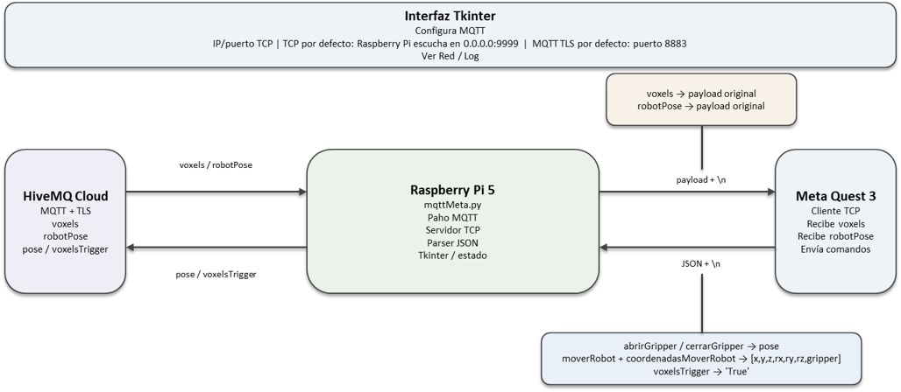
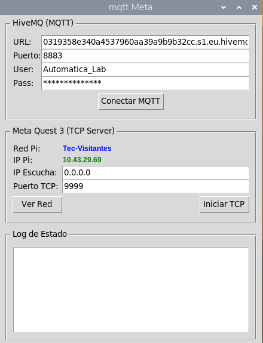

**COBOT PARA INCLUSION:**

**estación de operador**

**Versión: 7 agosto 2026**

**Subestación: Celda robot**

**Nombre de script: mqttMeta.py**

**Descripción: Gateway entre HiveMQ y Meta Quest 3 para pose del robot y datos de voxels**

# 1\. Objetivo del sistema

mqttMeta.py se ejecuta en una Raspberry Pi 5 y funciona como gateway entre un broker MQTT HiveMQ y un visor Meta Quest 3. El programa recibe desde MQTT los mensajes de voxels y de la pose real del robot y los reenvía al Quest 3 mediante TCP/IP. En sentido inverso, recibe desde el Quest 3 mensajes JSON con comandos de movimiento y acciones del gripper, y traduce esas acciones a mensajes MQTT destinados al sistema que controla el robot.

# 2\. Arquitectura general

| Componente     | Tecnología          | Función                                                                         |
| -------------- | ------------------- | ------------------------------------------------------------------------------- |
| Raspberry Pi 5 | Python / Tkinter    | Gateway de comunicación y servidor TCP.                                         |
| HiveMQ Cloud   | MQTT + TLS          | Fuente de voxels/robotPose y destino de comandos pose/voxelsTrigger.            |
| Meta Quest 3   | TCP/IP              | Cliente del gateway; recibe datos de escena/robot y envía comandos del usuario. |
| Paho MQTT      | MQTT                | Cliente MQTT asíncrono.                                                         |
| Socket TCP     | TCP/IP              | Servidor que escucha conexiones del Quest 3.                                    |
| JSON           | Formato de mensajes | Serializa los mensajes MQTT y los comandos recibidos por TCP.                   |

# 3\. Canales de comunicación

| Canal | Dirección              | Puerto / tópico  | Contenido                                                         |
| ----- | ---------------------- | ---------------- | ----------------------------------------------------------------- |
| MQTT  | HiveMQ → Raspberry Pi  | voxels           | Información de voxels recibida como payload y reenviada al Quest. |
| MQTT  | HiveMQ → Raspberry Pi  | robotPose        | Pose real del robot recibida como payload y reenviada al Quest.   |
| TCP   | Raspberry Pi → Quest 3 | 9999 por defecto | Payload MQTT recibido, seguido de \\n.                            |
| TCP   | Quest 3 → Raspberry Pi | 9999 por defecto | JSON con botones/acciones y coordenadas del robot.                |
| MQTT  | Raspberry Pi → HiveMQ  | pose             | Comandos de gripper o pose deseada del robot.                     |
| MQTT  | Raspberry Pi → HiveMQ  | voxelsTrigger    | Trigger textual 'True' para solicitar/activar el flujo de voxels. |

# 4\. Conexión MQTT con HiveMQ

El usuario configura URL, puerto, usuario y contraseña desde la interfaz. Si el puerto es 8883, el script activa TLS mediante tls_set(). La conexión utiliza keepalive de 60 segundos y loop_start() para ejecutar la red MQTT en segundo plano.

Una vez conectado, el programa se suscribe a los tópicos voxels y robotPose. El callback on_mqtt_message recibe ambos tipos de mensajes y, si existe una conexión TCP activa con Quest 3, reenvía el payload exactamente como texto UTF-8 con un salto de línea.

# 5\. Flujo HiveMQ → Quest 3

1. 1\. HiveMQ entrega un mensaje en voxels o robotPose.
2. 2\. on_mqtt_message() obtiene msg.payload y lo decodifica como UTF-8.
3. 3\. El payload no se transforma ni se parsea en este tramo.
4. 4\. Si quest_socket está conectado, se añade '\\n'.
5. 5\. Raspberry Pi envía el mensaje mediante sendall() al Quest 3.
6. 6\. Si el envío falla, quest_socket se invalida y se registra la pérdida de conexión.

# 6\. Información de voxels

El script actúa como transporte de los datos de voxels. De acuerdo con la función on_mqtt_message(), el payload recibido en voxels se reenvía al Quest 3 sin interpretar su estructura. Por tanto, el formato concreto de cada voxel -por ejemplo coordenadas x,y,z y canales RGB- es responsabilidad del productor MQTT y del consumidor Quest 3; este script no valida ni modifica esos campos.

# 7\. Pose real del robot

El tópico robotPose se trata de la misma manera que voxels: el payload recibido desde HiveMQ se transmite directamente al Quest 3. El gateway no realiza conversiones de unidades, límites ni transformaciones geométricas sobre esta pose.

# 8\. Servidor TCP para Meta Quest 3

La Raspberry Pi crea un socket IPv4 TCP con SO_REUSEADDR, lo enlaza a la IP de escucha indicada en la interfaz y al puerto configurado. El valor inicial de IP es 0.0.0.0 y el puerto inicial es 9999, por lo que el servidor puede aceptar conexiones en las interfaces de red de la Raspberry Pi.

El servidor utiliza listen(1), por lo que está preparado para una conexión pendiente a la vez. Al aceptar una conexión, conserva el socket en quest_socket y entra en un bucle de recepción.

# 9\. Flujo Quest 3 → Raspberry Pi

1. 1\. Quest 3 establece una conexión TCP con la Raspberry Pi.
2. 2\. listen_tcp_loop() recibe bytes mediante recv(16384).
3. 3\. Los bytes se decodifican como UTF-8.
4. 4\. Los fragmentos se acumulan en buffer.
5. 5\. El buffer se divide por '\\n' para obtener mensajes completos.
6. 6\. Cada línea se convierte de JSON a diccionario Python.
7. 7\. Se extraen abrirGripper, cerrarGripper, moverRobot y voxelsTrigger.
8. 8\. Se extrae coordenadasMoverRobot.
9. 9\. Según las banderas, se publican los mensajes MQTT correspondientes.

# 10\. Formato esperado desde Quest 3

El código espera un objeto JSON con las siguientes claves:

| Campo                 | Tipo esperado | Uso                                                        |
| --------------------- | ------------- | ---------------------------------------------------------- |
| abrirGripper          | boolean       | Publica pose con gripper=0.0.                              |
| cerrarGripper         | boolean       | Publica pose con gripper=1.0.                              |
| moverRobot            | boolean       | Publica coordenadasMoverRobot junto con el gripper actual. |
| voxelsTrigger         | boolean       | Publica 'True' en voxelsTrigger.                           |
| coordenadasMoverRobot | lista         | Se utilizan los seis primeros elementos para la pose.      |

Las cuatro banderas tienen False como valor por defecto si no existen. coordenadasMoverRobot tiene \[\] como valor por defecto; por ello, cuando moverRobot=True, el consumidor debe proporcionar al menos seis valores para evitar un acceso fuera de rango.

# 11\. Comandos MQTT generados

Los comandos de abrir/cerrar gripper y mover robot se publican en MQTT_TOPIC_POSE, cuyo valor en el script es 'pose'.

| Acción Quest       | Payload MQTT en pose                | Efecto                                         |
| ------------------ | ----------------------------------- | ---------------------------------------------- |
| abrirGripper=True  | \[0.0,0.0,0.0,0.0,0.0,0.0,0.0\]     | Gripper numérico = 0.0.                        |
| cerrarGripper=True | \[0.0,0.0,0.0,0.0,0.0,0.0,1.0\]     | Gripper numérico = 1.0.                        |
| moverRobot=True    | \[x,y,z,rx,ry,rz,gripper_numerico\] | Pose deseada conservando el estado de gripper. |

El script conserva gripper_numerico como estado global. Abrir y cerrar modifican ese estado; moverRobot utiliza el último valor conocido.

# 12\. Trigger de voxels

Cuando voxelsTrigger=True en el mensaje procedente del Quest 3, el programa publica el texto 'True' en el tópico voxelsTrigger. El código no especifica aquí qué componente consumidor realiza la acción posterior.

# 13\. Concurrencia

El sistema utiliza al menos dos flujos de ejecución secundarios: Paho MQTT ejecuta su loop de red mediante loop_start(), y el servidor TCP se ejecuta en un hilo daemon creado por toggle_tcp(). La interfaz Tkinter permanece en el hilo principal. log() utiliza root.after() para actualizar el cuadro de texto desde forma segura respecto al hilo de GUI.

# 14\. Interfaz gráfica

La ventana se denomina 'mqtt Meta' y tiene una geometría inicial de 440×550. Incluye configuración de HiveMQ, configuración del servidor TCP para Quest 3, visualización de red y un panel de log.

- URL, puerto, usuario y contraseña de HiveMQ.
- IP de escucha TCP, inicialmente 0.0.0.0.
- Puerto TCP, inicialmente 9999.
- Botón Conectar/Desconectar MQTT.
- Botón Ver Red.
- Botón Iniciar/Detener TCP.
- Log de estado.

# 15\. Detección de red

get_network_info() determina la IP local creando temporalmente un socket UDP hacia 8.8.8.8:80 y consultando getsockname(). También intenta obtener el SSID mediante iwgetid -r. Si no hay SSID, muestra 'Ethernet / Cable'; si la consulta falla, muestra 'Desconectado'.

# 16\. Dependencias

- Python 3
- paho-mqtt
- tkinter
- socket (stdlib)
- threading (stdlib)
- subprocess (stdlib)
- json (stdlib)
- Comando iwgetid disponible en Linux

# 17\. Parámetros principales

| Parámetro        | Valor inicial      | Descripción                                                                |
| ---------------- | ------------------ | -------------------------------------------------------------------------- |
| MQTT puerto      | 8883               | Puerto TLS; el script activa TLS específicamente cuando el puerto es 8883. |
| TCP IP escucha   | 0.0.0.0            | Escucha en todas las interfaces IPv4.                                      |
| TCP puerto       | 9999               | Puerto del servidor TCP para Quest 3.                                      |
| MQTT_TOPIC_POSE  | pose               | Tópico de comandos de pose.                                                |
| MQTT suscripción | voxels / robotPose | Datos enviados al Quest 3.                                                 |
| Trigger          | voxelsTrigger      | Tópico de activación de voxels.                                            |

# 18\. Manejo de conexiones

MQTT puede conectarse/desconectarse desde la interfaz. El servidor TCP puede iniciarse/detenerse desde la interfaz. Cuando se cierra la conexión Quest, el socket se cierra y quest_socket se establece nuevamente en None. El código no implementa un mecanismo explícito de reconexión automática MQTT ni un cliente TCP activo desde la Raspberry Pi: Quest 3 debe volver a conectarse al servidor cuando sea necesario.

# 19\. Seguridad y recomendaciones

**Credenciales:** El script contiene credenciales MQTT directamente en el código. Para producción deberían trasladarse a variables de entorno o un archivo seguro.

**TLS:** El puerto 8883 activa TLS mediante tls_set(), lo cual protege el canal MQTT. La comunicación TCP con Quest 3 no utiliza TLS en este script.

**Validación JSON:** Conviene validar tipos, longitud de coordenadas y rangos antes de publicar pose.

**moverRobot:** Actualmente acceder a coor_robot\[0\]...\[5\] sin validar longitud puede provocar una excepción si faltan coordenadas.

**Prioridad de comandos:** Si varias banderas llegan True simultáneamente, se ejecutan secuencialmente según el código: abrir, cerrar, mover y trigger.

**Confirmación:** No existe ACK de aplicación para confirmar que Quest recibió voxels/robotPose ni que HiveMQ recibió/ejecutó la pose.

**Voxels:** El gateway no comprueba el tamaño del payload ni su estructura. Para listas grandes de voxels conviene considerar fragmentación, compresión o un formato binario si el volumen de datos lo requiere.

# 20\. Funciones principales

| Función                  | Responsabilidad                                        |
| ------------------------ | ------------------------------------------------------ |
| get_network_info()       | Obtiene SSID y dirección IP local.                     |
| on_mqtt_message()        | Reenvía payloads MQTT de voxels/robotPose al Quest 3.  |
| \_async_mqtt_connect()   | Configura TLS, conecta y suscribe el cliente MQTT.     |
| toggle_mqtt()            | Inicia o detiene la conexión MQTT.                     |
| listen_tcp_loop()        | Acepta Quest 3, recibe JSON y traduce acciones a MQTT. |
| toggle_tcp()             | Crea/detiene el servidor TCP.                          |
| update_network_display() | Actualiza la información de red en la GUI.             |
| log() / \_safe_log()     | Registra eventos en el panel de interfaz.              |

# 21\. Flujo completo de datos

Sentido de visualización: HiveMQ → MQTT (voxels/robotPose) → Raspberry Pi → TCP → Meta Quest 3.

Sentido de control: Meta Quest 3 → TCP JSON → Raspberry Pi → interpretación de banderas/coordenadas → MQTT pose/voxelsTrigger → HiveMQ.

De esta forma la Raspberry Pi desacopla los protocolos MQTT y TCP y funciona como punto de integración entre el sistema de robot y la aplicación inmersiva.

# 22\. Referencia al código fuente

El código contiene 304 líneas y organiza el sistema alrededor de dos canales de comunicación: un cliente MQTT para HiveMQ y un servidor TCP para Meta Quest 3, ambos controlados desde una interfaz Tkinter.