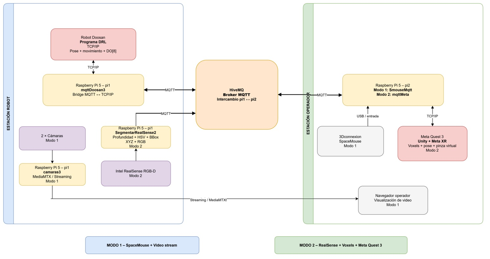
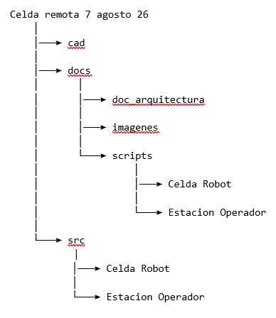

**COBOT PARA INCLUSION:**

**celda robótica teleoperada**

**index**

\
**Versión:    7 agosto 2026**

**Realizado: Tec de Monterrey**

**Líder de proyecto: Carlos Renato Vázquez Topete**

**cr.vazquez@tec.mx**

# **1. Propósito y alcance**
Esta página documenta el desarrollo de una celda robótica teleoperada para el proyecto Robótica y modelos formales para la inclusión de personas con discapacidad en la industria de manufactura.

La celda ha sido desarrollada para la ejecución de tareas de ensamble y manipulación por medio de un robot colaborativo Doosan con un gripper On Robot de 2 dedos, de 10kg de payload y 1.2m de alcance. La teleoperación es realizada a través de un servidor mqtt accesible por internet a través del servicio Hivemq, lo que permite que el operador pueda estar en cualquier lugar con conexión a internet. La teleoperación está diseñada para ser ejecutada con una sola mano, y requiere agudeza visual normal, por parte del operador. 
# **2. Modos de operación**

La celda permite dos modos de operación. 

Modo 1: el operador controla el robot utilizando un SpaceMouse, y recibe retroalimentación del estado de la celda por medio de dos cámaras web estándar que transmiten video desde dos ángulos diferentes.

Modo 2: el operador utiliza un visor de realidad virtual, en el que se ejecuta una aplicación de realidad aumentada que permite el control del robot de manera intuitiva ya sea utilizando el mando del visor o utilizando su propia mano, la retroalimentación de la escena consiste en una reconstrucción 3D virtual de las piezas a manipular en la escena que es generada por una cámara de profundidad Intel Real Sense 2. 

# **3. Vista general de la arquitectura**

|Componente|Ubicación|Software / interfaz|Función|
| :- | :- | :- | :- |
|Robot Doosan|Estación robot|Programa DRL documentado|Ejecuta movimientos y controla gripper.|
|Raspberry pi 5, denominada pi1|Estación robot|Raspberry Pi 5|Puente robot–MQTT; cámaras; segmentación RealSense.|
|Raspberry pi 5, denominada pi2|Estación operador|Raspberry Pi 5|Entrada SpaceMouse o puente Meta Quest–MQTT.|
|HiveMQ|Servidor central|MQTT|Intercambio de mensajes entre pi1 y pi2.|
|SpaceMouse 3Dconnexion|Estación operador|USB / SmouseMqtt|Genera comandos de teleoperación en Modo 1.|
|Dos cámaras web estándar|Estación robot|camaras3 + MediaMTX|Streaming de video en Modo 1.|
|Cámara de profundidad Intel RealSense 2 RGB-D|Estación robot|SegmentarRealSense2|Segmentación por profundidad/color y generación de voxels en Modo 2.|
|Meta Quest 3|Estación operador|Unity / Meta XR + mqttMeta|Visualización AR e interacción espacial en Modo 2.|

Los detalles de la arquitectura se presentan en el documento //Celda remota 7 agosto 26/docs/doc\_arquitectura

# **4. Organización**

# **5. Declaración de uso de IA**

Se ha utilizado IA en la generación de texto e imágenes de esta documentación, y la generación de partes de código de los scripts.